# 湖南小水电集控平台 概要设计 v1（架构篇）

> 状态：头脑风暴定型，仅含架构层（分区软件清单、关键数据流、技术选型、部署拓扑）。详细接口/表设计后续版本展开。
> 依据：SL/T 870—2026 小水电集控中心技术规范；用户提供的需求 Excel；网络结构示意图。

## 目录

- [一、关键架构决策摘要](#一关键架构决策摘要)
- [二、总体部署拓扑](#二总体部署拓扑)
- [三、数据采集流程（上行，Ⅰ→Ⅳ）](#三数据采集流程上行ⅰⅳ)
- [四、控制指令流程（下行，Ⅳ→Ⅰ）](#四控制指令流程下行ⅳⅰ)
  - [4.1 三方式控制权限状态机](#41-三方式控制权限状态机规范-613)
  - [4.2 配置数据反向同步路径](#42-配置数据反向同步路径决策第-27-条落地)
- [五、告警处理流程](#五告警处理流程)
- [六、主备切换机制](#六主备切换机制)
- [七、部署节点详图](#七部署节点详图)
  - [7.6 存储容量估算](#76-存储容量估算)
  - [7.7 网络规划原则](#77-网络规划原则)
- [八、关键非功能性需求落地点](#八关键非功能性需求落地点)
  - [8.1 日志聚合与审计](#81-日志聚合与审计)
  - [8.2 系统自身监控](#82-系统自身监控)
  - [8.3 第三方依赖降级策略](#83-第三方依赖降级策略)
  - [8.4 端到端时延分解](#端到端时延分解)
- [九、需求溯源与功能对齐](#九需求溯源与功能对齐)
- [十、菜单补充：网络拓扑图](#十菜单补充网络拓扑图)
- [十一、本期不展开但需后续设计](#十一本期不展开但需后续设计)
- [术语表](#术语表)
- [十二、变更记录](#十二变更记录)

---


## 一、关键架构决策摘要

| # | 主题 | 决策 |
|---|---|---|
| 1 | 安全分区 | 严格按 SL/T 870 划分 Ⅰ/Ⅱ/Ⅲ/Ⅳ 四区，横向隔离纵向认证 |
| 2 | Ⅰ 区软件架构 | 严格 C/S（规范 5.1.8 硬性要求），BS 仅用于 Ⅲ/Ⅳ 区 |
| 3 | 数据隔离机方向 | 仅 Ⅰ→Ⅳ 单向 UDP，承载数据/告警/SOE 上行 |
| 4 | 反向通道（Ⅳ→Ⅰ） | 统一走反向隔离装置（白名单+签名+结构化指令） |
| 5 | 历史数据存储 | 二区和四区均用 TDengine 时序库：二区小集群（2节点）承生产控制大区就近归档，四区集群（3节点）承管理信息区历史查询 |
| 6 | 三方式控制权限 | 核心功能，优先级 现地 > 电站 > 集控，无扰动切换、唯一性校验 |
| 7 | 指令进度 | 事件源模型，进度事件全部持久化，主备切换/重启可续接 |
| 8 | 消息中心 | 统一一套，type 字段区分告警/SOE/指令反馈/运维私信/系统通知 |
| 9 | 设备模型 | 保留父子层级（电站→机组→部件） |
| 10 | 视频 | 全走萤石云走公网，集控侧不做本地存储备份 |
| 11 | 水平扩展 | 单集控中心内 Ⅲ/Ⅳ 区多节点扩展；Ⅰ 区主备不做横向扩展 |
| 12 | 移动端 | 响应式 Web，需在手机上保证集控中左中右布局可用且美观 |
| 13 | 电力调度数据网 | 本期不接入（Ⅱ 区不部署纵向加密+调度通信网关） |
| 14 | 数字孪生 | 预留架构位，本期不实现 |
| 15 | 多运维中心 | 单集控中心物理部署，逻辑上 公司→运维中心→测站 树形层级 |
| 16 | AGC/AVC | 本期仅做下发接口，不实现算法 |
| 17 | Ⅰ 区当前值/订阅层 | Redis Cluster（当前值，开源社区版）+ RocketMQ（事件流，替代 Kafka）组合，取消独立实时库组件 |
| 18 | RECV 主备 | VIP+Keepalived 主备（考虑核电站等只支持单推），不做双活 |
| 19 | VIP 合并 | RECV-VIP 与 CMD-VIP 合并到同一套 Keepalived 实例，2 台物理机混部 |
| 20 | Sentinel 节点数 | 3 节点 |
| 21 | 四区业务库主备 | Keepalived + MySQL/PG 主从流复制（不引入 Orchestrator/Etcd，与一区运维风格一致） |
| 22 | 会话方案 | JWT（Access 15min + Refresh 8h）+ 四区 Redis 存吊销黑名单；无传统 session |
| 23 | 网关管理位置 | 放一区。功能：站级监控接入配置、协议参数维护、VIP/路由配置；前后端都在一区，作为 CS 工作站的子模块 |
| 24 | 接入规模 | 最大 1.2 万测点、500 Web 并发；按此规模定部署清单 |
| 25 | 操作员席位 | 4 席 CS 工作站（主值班+副值班+派单+机动） |
| 26 | 国产化策略 | 服务器/OS 优先国产（鲲鹏或飞腾 + 麒麟/统信）；已定的开源中间件（Redis/RocketMQ/MySQL）维持，不改 |
| 27 | 配置数据反向同步 | 所有运行时配置权威源在四区业务库，经反向隔离装置 push 到一区并热加载，带版本号增量同步；同步对象清单包括：①点表（协议地址→测点ID映射）②设备模型/参数边界 ③告警规则/阈值/滞回带 ④接入电站配置 ⑤闭锁条件 ⑥控制权限 ⑦AGC/AVC 参数；详细协议格式/回执机制放 v2 详细设计 |

---

## 二、总体部署拓扑

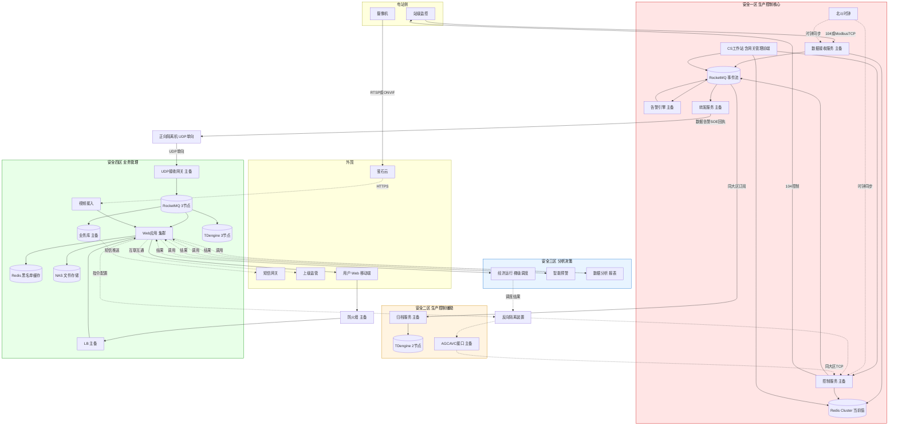

### 说明

- **粗实线**承载高频/大流量数据（采集、上送、视频）；**虚线**承载控制/低频/配置通道
- **一区内部数据流闭环**：RECV 写 Redis（当前值）+ 发 RocketMQ（事件流）；ALM/FWD 订阅 MQ；CMD 和 CS 都访问 Redis+MQ
- **告警链路**：ALM 订阅 MQ 实时事件 → 规则匹配生成告警 → 发回 MQ（alarms 主题）→ FWD 订阅 → 打包经正向隔离 UDP 上送四区；一区本地 CS 也订阅 alarms 主题做弹窗+音响
- **上送四区经四区 RocketMQ fanout**：Z4_GW UDP 收端解包后先写四区 RocketMQ，由多个消费者订阅（TDengine / 业务库 / Web WebSocket），符合决策第 17 条保留四区 RocketMQ 做分发解耦
- **四区 RocketMQ 承担场景**（决策 17 落地）：
  - **主 fanout 消费者**（图中显式画出的 3 条 Z4_MQ 输出线）：
    1. **TDengine 写入**：时序数据持久化
    2. **业务库写入**：告警、SOE、指令回执入消息中心表
    3. **Web WebSocket 推送**：前端实时页面更新
  - **派生订阅者**（由 Web 应用或独立 worker 订阅特定主题，图中未显式画出）：
    4. **告警外发任务**：消费"alarms"主题触发短信/APP 推送/语音联动（经由消息中心表+独立推送 worker）
    5. **配置同步事件总线**：四区配置变更事件发布、反向隔离下发任务触发
    6. **Web 后台异步任务**：报表生成、数据导出、视频快照归档等耗时任务
- **四区 RocketMQ 消息堆积与背压策略**：
  - **消费者滞后监控**：Prometheus + RocketMQ Exporter 实时监控每个消费者组的 lag，阈值触发告警
  - **分级 TTL**：实时事件（current_values）TTL 1 小时，超期丢弃（一区有对账机制可补）；告警事件 TTL 7 天（合规要求保留）；异步任务无 TTL
  - **不反压到一区 GW**：四区 MQ 堆积**不回压**一区，因为正向隔离机是单向 UDP，一区无法感知四区状态；四区消费端堆积只在四区内处理（降级、扩容、丢弃）
  - **消费者降级策略**：TDengine 写入优先级 > 消息中心入库 > Web 推送；Web 推送可短暂丢帧，不影响持久化
  - **扩容**：消费者滞后持续超过阈值时触发水平扩展（Web/GW 都是无状态），或临时提升 Broker/TDengine 规格
- **二区归档**：Z2_HIS 从一区 RocketMQ **同大区内订阅**（不经隔离机，就近归档）→ 写 Z2_TD
- **Ⅲ → Ⅱ AGC 链路**：Z3_EDC 调度结果跨大区 → **反向隔离装置** → Z2_AGC → **同大区 TCP** → Z1_CMD
- **Ⅲ ↔ Ⅳ 同大区访问**：Web 调用三区分析服务，结果回 Web 展示
- **Z1_CMD 控制下行**：CMD 经 104 报文直接下发到站级监控，回执随采集上行路径返回
- **用户访问**：用户 → 公网防火墙 → LB → Web，Web 再访问 Redis/DB/TD/MQ/NAS
- **Z1_SCADA 节点已移除**：v1.3+ 后"SCADA"已拆为 RECV/CMD/告警/转发四个独立服务
- **北斗时钟分区分发**（规范 5.1.7）：
  - 北斗装置部署在一区作为根时间源
  - 每区核心交换机各部署一个 NTP 从服务器（小型设备或服务器进程），通过隔离机的 NTP 单向通道（隔离机一般支持 NTP 透传）从一区时钟同步
  - 各区服务器和工作站从本区 NTP 从服务器拉取时间，**不跨大区直接拉取**（因为 PTP/NTP 跨隔离机有特殊性）
  - 这样保证：①SOE 毫秒级时标全局一致 ②UDP 序号窗口时间一致 ③告警时间戳一致 ④日志审计时间一致
- **不接电力调度数据网**：本期 Ⅱ 区不部署纵向加密装置和调度通信网关

---

## 三、数据采集流程（上行，Ⅰ→Ⅳ）

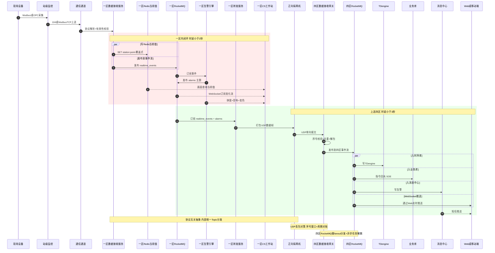

### 说明

- **Ⅰ 区中间件分工**：
  - **Redis Cluster** 承担"当前值仓库"：每个测点的最新值，覆盖式写入，key 格式 `station_id:point_id`；供 CS、CMD、告警引擎随机查询
  - **RocketMQ** 承担"事件流总线"：测点变化、SOE、告警、指令反馈等以事件方式发布；多消费者订阅，订阅/发布解耦
  - 取消独立"实时库"概念：原"实时库"的查询职责由 Redis 承担，订阅职责由 RocketMQ 承担
- **三个并行通路**：写 Redis（当前值）、发 RocketMQ（事件流）、转发服务订阅后送 Ⅳ 区，互不阻塞，满足规范 5.2.1 时延指标
- **协议无关抽象**：RECV 内部用 Topic + 消息体抽象，将来加 102 规约/IEC 61850 只需扩 RECV 层
- **水平扩展（Topic 分区）**：Ⅳ 区采用消息队列（RocketMQ），将上行数据 Topic 切分为 N 个 Partition：
  - GW 接到 UDP 包后按 `hash(测站ID) % N` 投递到对应分区
  - 同一测站的所有数据保证投递到同一分区，单测站内顺序天然保证
  - N 个消费者实例各自独占一个分区，并行入 TDengine、入消息中心
  - 扩容时增加分区数+消费者实例，rebalance 自动重分配
  - 单分区故障不影响其他测站
- **时延符合规范 5.2.1**：模拟量≤3 s、状态量≤2 s、服务器间传输≤1 s

### UDP 单向对账机制

因 UDP 仅 Ⅰ→Ⅳ 单向、无 ACK，需三层兜底保证数据完整性：

| 层 | 机制 | 适用场景 | 触发方式 |
|---|---|---|---|
| 第一层：冗余发送（主防线） | 每帧带递增序号；同一时间窗口（如最近 5 秒）的数据**重复发送 3 次**，错开发送；Ⅳ 区按序号去重 | 偶发丢包（统计上覆盖 99.9% 场景） | 自动，常态运行 |
| 第二层：反向通道对账（异常补救） | Ⅳ 区 GW 维护"已收到序号位图"；检测到缺口持续>30 秒，通过**反向隔离装置**发对账请求 `{source_id, missing_seq_range}`；Ⅰ 区从本地"已发送历史缓存"（保留最近 N 分钟）取数重发 | 长时间网络抖动、隔离机短暂故障 | 自动，按周期触发 |
| 第三层：人工全量对账（极端兜底） | 运维终端导出某时段 Ⅰ 区全量数据 → 介质（U 盘/光盘）→ Ⅳ 区导入补齐 | 隔离机长时间故障、反向通道也异常 | 手动 |

**关键设计**：
- 一区 RECV 服务必须维护**已发送历史缓存**（按序号索引，环形 buffer，保留时长根据反向通道响应时间确定，建议≥10 分钟）
- 序号空间：每个数据源（站级监控）独立编号，避免单点序号溢出
- 对账请求走反向通道，不占用正向 UDP 带宽
- 三层方案互不依赖，任意一层失效仍有兜底

---

## 四、控制指令流程（下行，Ⅳ→Ⅰ）

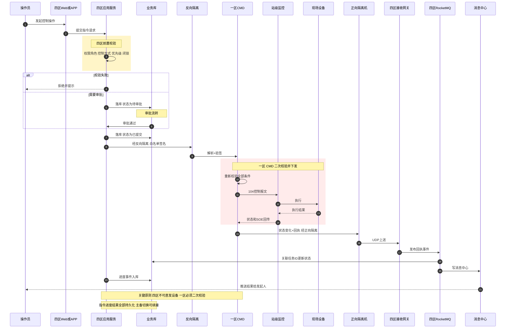

### 说明

- **一区分层**（v1.3+ 后没有独立的"SCADA"组件，原 SCADA 职能拆为 4 个独立服务）：
  - **CS 操作员工作站**：人机交互、画面渲染、操作员手动操作；自动化指令链路**不经过**它
  - **RECV**：电站数据接收和协议解析，写 Redis + 发 RocketMQ
  - **CMD**：接收 Ⅳ 区指令，二次校验后直接经 104 下发到站级监控（不再有中间 SCADA 层）
  - **ALM**：告警引擎
  - **FWD**：转发服务，打包事件经正向隔离机送四区
- **CMD 访问 Redis 走 Sentinel 发现**：Redis 客户端配 Sentinel 地址列表，自动发现当前 Master，主备切换对 CMD 透明
- **反向通道**：Ⅳ→Ⅰ 统一走反向隔离装置（白名单+签名+结构化指令）
- **一区永远不信任四区**：CMD 服务收到指令后**必须重新校验**权限、当前控制方式、优先级、闭锁条件
- **指令状态机**：已提交 → 执行中 → 执行结束（成功 / 失败 / 超时 / 取消），所有状态变迁入库
- **三方式控制优先级（规范 6.1.3）**：现地 > 电站 > 集控；当前控制方式不是"集控"时 CMD 直接拒绝
- **持久化粒度**：指令主表 + 每一次进度事件入库（事件源），服务器重启/主备切换可凭任务 ID 续接
- **指令回执上行也走正向通道**：避免反向通道承担数据流量，保持反向通道纯粹用于下发
- **反向通道的另一用途**：除控制指令外，还承担**四区到一区的配置数据同步**（点表、告警规则、闭锁条件、控制权限等），权威源在四区业务库，经反向隔离装置 push 到一区并热加载——详见决策第 27 条与 v2 详细设计

### 4.1 三方式控制权限状态机（规范 6.1.3）

#### 4.1.1 三种控制方式

| 方式 | 含义 | 物理实现 | 优先级 |
|---|---|---|---|
| **现地 local** | 在设备现场屏柜操作 | 屏柜面板硬件转换开关拨到 "local" 位 | 1（最高） |
| **电站 station** | 在电站站级监控软件操作 | 屏柜开关在 "remote" 位 + 站级软件设为 station | 2 |
| **集控 central** | 在集控中心 CS 工作站操作 | 屏柜开关在 "remote" 位 + 站级软件设为 central | 3（最低） |

**优先级语义**：高优先级可以抢占低优先级；低优先级**不能**抢占高优先级。任意时刻每台设备的控制方式**唯一**。

**重要**：`control_mode` 只回答"**谁**有权控"，还需要正交的字段回答"**现在能不能控**"。完整控制状态字见 4.1.2。

#### 4.1.2 完整控制状态字

本项目采用"3 字段 + 1 计算字段"设计：

| 字段 | 类型 | 含义 | 权威源 |
|---|---|---|---|
| `control_mode` | enum: local/station/central | 谁有权控（见 4.1.1） | 现场屏柜硬件开关 + PLC 状态字 |
| `control_enabled` | bool | 人工挂牌综合：值班员是否挂牌禁控 + 是否在运维窗口 | 四区 Web 挂牌（经反向隔离同步到一区） |
| `health` | enum: good/degraded/bad | 健康度综合：通信+数据质量+设备自诊断 | 一区判断（通信+质量）+ 站级上送（自诊断） |
| `controllable` | bool（计算） | 当前是否允许遥控（只读） | 下面的计算式 |

**controllable 计算式**：

```
controllable = (control_mode == 'central')
           AND (control_enabled == true)
           AND (health == 'good')
```

任一条件不满足 → `controllable == false` → 集控遥控指令必须被拒。

**health 三态语义**：

| 值 | 含义 | controllable 贡献 |
|---|---|---|
| `good` | 通信正常 + 数据质量 good + 设备自诊断 healthy | 允许贡献为 true |
| `degraded` | 任一子项性能劣化但尚可用（如：通信高时延未超时、质量 stale 但数据可读、自诊断轻微警告） | **本期保守处理：视为不可控**（日后可按指令类型细化——例如"关键指令禁/非关键指令放" 放到 v2 详细设计） |
| `bad` | 严重异常（通信断/设备故障/自诊断失败） | 视为不可控 |

**字段变更来源**：

| 字段 | 变更触发 | 传递路径 |
|---|---|---|
| `control_mode` | 现场拨开关 / 站级软件切换 / 集控请求切换 | 硬件→PLC→站级→一区Redis→正向隔离→四区业务库 |
| `control_enabled` | 四区 Web 挂牌/摘牌、维护窗口开启/关闭 | 四区 Web→反向隔离→一区Redis→站级（决策 27 条配置同步） |
| `health` | 通信中断、质量劣化、自诊断故障 | 一区 RECV/一区告警引擎/站级 PLC→一区 Redis→正向隔离→四区 |

#### 4.1.3 状态机（仅 control_mode 维度）

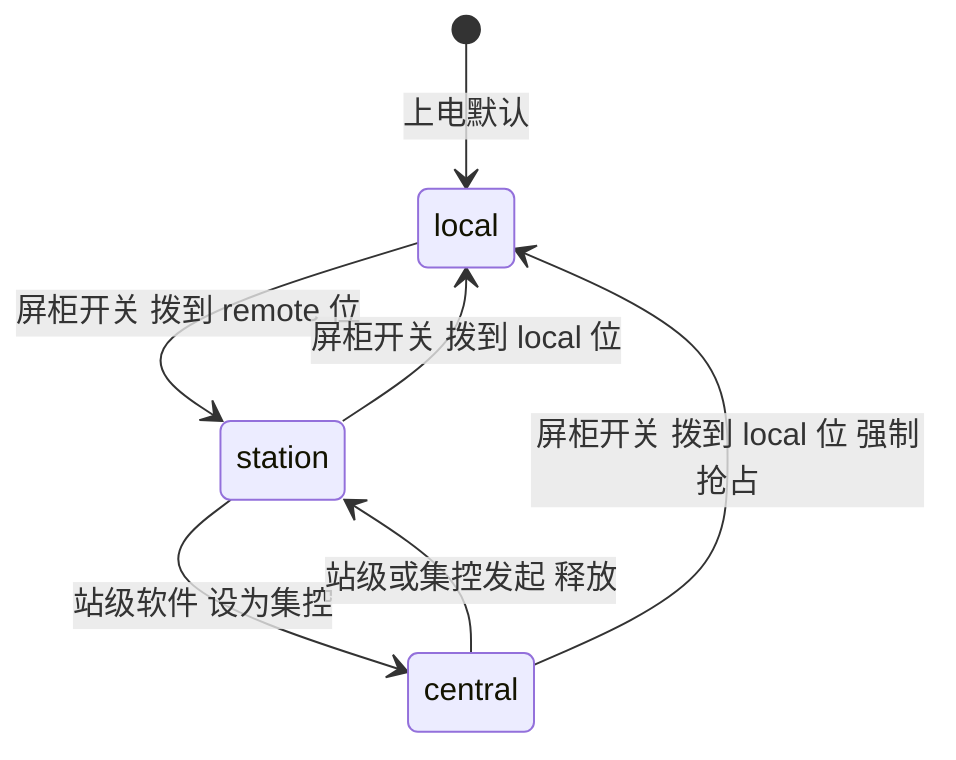

**关键规则**：
- `local → station` / `station → local`：**硬件级**，由现场屏柜物理转换开关决定，软件不可控
- `station → central`：在站级软件操作（也可由集控请求站级转换）
- `central → station`：集控释放（操作员主动放弃）或站级回收（站级值班员收回）
- `central → local`：现地物理抢占，**任何状态都允许直接被现地抢占**（最高优先级硬切）

`control_enabled` 和 `health` 是独立维度，不体现在这张状态机里（它们各有各的变化，与 mode 无耦合）。

#### 4.1.4 控制状态的全链路校验（防止越权指令）

控制状态在多处有副本，但 `control_mode` 的权威源是**现场硬件**，其他字段的权威源见 4.1.2。副本必须严格同步：

| 副本位置 | 存储内容 | 用途 |
|---|---|---|
| 现场屏柜 PLC | `control_mode`（硬件开关+状态字）、`health`（自诊断） | 设备级真相 |
| 站级监控 | 完整状态字（4 字段） | 站级控制决策 |
| 一区 Redis | 每台设备的完整状态字 | 一区 CMD 控制前校验 |
| 四区业务库 | 每台设备的完整状态字副本 | 四区 Web 显示 + 前置校验 |

**指令链路三次校验**（每次都校验完整 `controllable` 计算结果）：

1. **四区 APP 前置校验**：从四区业务库读状态字，计算 controllable；为 false 则**直接拒绝**，并向用户提示**具体不可控原因**（mode 不对 / 已挂牌 / 通信中断 / 设备故障 / 质量差）
2. **一区 CMD 二次校验**：从一区 Redis 读状态字，重新计算 controllable；为 false 则**直接拒绝**，不下发到站级
3. **站级三次校验**：站级收到 104 控制报文时，读本地最新状态字，再次计算 controllable（防止副本过期）；为 false 直接拒绝并上送告警

**任何一层校验失败 → 指令立即拒绝并落库**，且推送给发起人，消息中附不可控的具体字段值。

#### 4.1.5 集控发起切换控制权的序列

集控不能"自抢"，必须**请求站级**，由站级判断后切换：

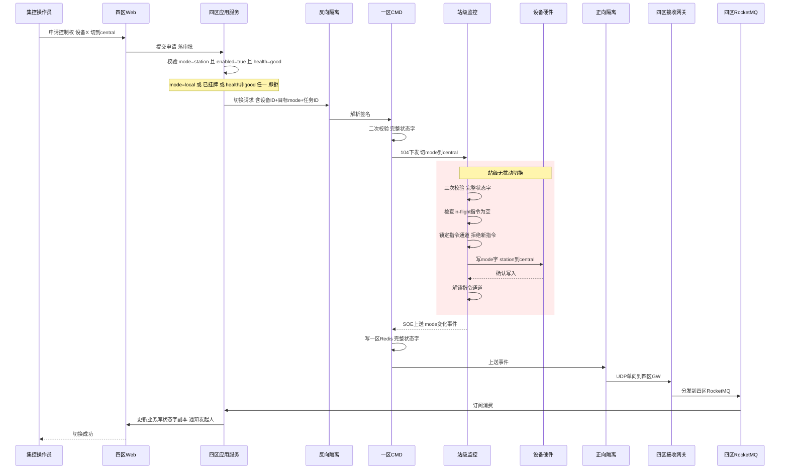

#### 4.1.6 无扰动切换保证

参考规范 5.2.1.6 与 6.1.3："切换中不应使外部设备误动作"。

**保证机制**（站级实现）：

1. **切换前置条件**：设备无 in-flight 指令（指令状态 = idle）
2. **锁定窗口**：站级在写 mode 字前后开启短锁（通常<100ms），拒绝新指令
3. **mode 字原子写**：硬件 PLC 的 mode 寄存器原子操作，不存在"半切换"中间态
4. **会话清理**：旧持有方（如 central → station，则集控的）的 TCP 会话被站级主动 close
5. **切换事件 SOE**：mode 变更作为 SOE 事件上送，全链路告知

#### 4.1.7 与告警/数据上送的关系

**控制方式不影响数据上送**——无论 local/station/central，电站持续上送数据、告警、SOE。

控制方式**只影响**控制指令的接受方：
- mode = local：站级和集控的所有控制指令都被拒
- mode = station：集控的控制指令被拒；站级可控
- mode = central：站级的控制指令被拒；集控可控

#### 4.1.8 切换审计

每次 mode 变更必须留痕，落入消息中心 + 业务库：
- 时间、设备 ID、原 mode、新 mode、发起人（现场人员/站级值班员/集控操作员）
- 物理切换（屏柜开关）也要被站级 PLC 感知并上送 SOE
- 集控发起的切换有完整审批流记录

### 4.2 配置数据反向同步路径（决策第 27 条落地）

**权威源**：所有运行时配置的权威源在**四区业务库**，经反向隔离装置 push 到一区并热加载。

**同步对象清单**（7 类）：

| 配置类别 | 更新触发 | 下发路径 | 一区接收方 | 热加载方式 | 回执路径 |
|---|---|---|---|---|---|
| ① 点表（协议地址→测点ID映射） | 四区 Web 点表管理页面保存 | 四区业务库 → 反向隔离 → 一区 RECV | RECV 服务 | 版本号比对，增量更新内存映射表 | 一区 RECV → 正向隔离 → 四区 GW → 业务库（写同步状态表） |
| ② 设备模型/参数边界 | 四区设备台账修改 | 同上 | RECV + CMD | 重载设备树 + 参数校验规则 | 同上 |
| ③ 告警规则/阈值/滞回带 | 四区告警规则配置页面 | 同上 | ALM 告警引擎 | 版本号触发规则引擎热加载 | 同上 |
| ④ 接入电站配置（IP/端口/协议类型） | 四区电站接入管理 | 同上 | RECV + 网关管理 | 重载连接池配置 | 同上 |
| ⑤ 闭锁条件 | 四区闭锁规则配置 | 同上 | CMD | 重载闭锁规则引擎 | 同上 |
| ⑥ 控制权限（角色-设备-操作映射） | 四区用户权限管理 | 同上 | CMD | 重载权限矩阵 | 同上 |
| ⑦ AGC/AVC 参数 | 四区 AGC/AVC 参数配置 | 四区业务库 → 反向隔离 → 二区 AGC/AVC 接口 | 二区 AGC/AVC | 重载调度参数 | 二区 AGC → 正向隔离 → 四区 |

**同步机制**（简版，详细协议格式见 v2 详细设计）：

1. **版本号增量同步**：每类配置带独立版本号（单调递增），一区服务启动时拉取全量，运行时仅推送增量
2. **推送触发**：四区 Web 保存配置 → 业务库事务提交 → 触发同步任务 → 经反向隔离推送
3. **结构化指令**：JSON 格式，含 `{config_type, version, action: add/update/delete, payload, signature, nonce}`
4. **一区接收**：各服务监听配置同步端口 → 验签 → 版本号校验 → 热加载 → 回执（成功/失败+原因）
5. **回执经正向隔离回传**：一区 → UDP 上送 → 四区 GW → 业务库同步状态表
6. **首次部署全量灌入**：一区服务首次启动时主动拉取全量配置（经反向隔离的"拉取请求"）
7. **灾备恢复**：一区服务重启后自动对账版本号，缺失部分重新拉取

**频率与优先级**：

- 高频（秒级生效）：告警阈值、闭锁条件
- 中频（分钟级）：点表、设备模型
- 低频（小时级）：接入电站配置、AGC/AVC 参数
- 权限变更：立即生效（吊销 Token 走四区 Redis 黑名单，不经反向隔离）

---

## 五、告警处理流程

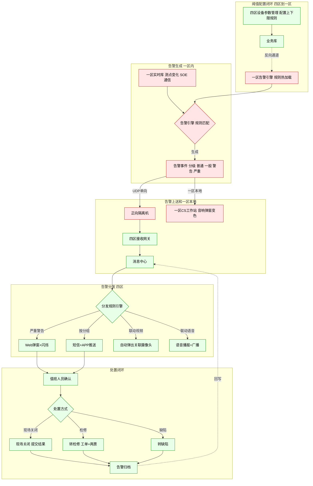

### 说明

- **核心架构**：告警引擎在 **Ⅰ 区**（贴近实时数据，时延低），但阈值/规则在 **Ⅳ 区** 配置，需经反向通道下发到一区生效
- **双呈现路径**：Ⅰ 区本地直接弹窗+音响（最快，规范 6.1.5）+ Ⅳ 区 Web/APP/短信（远程）
- **统一消息中心**：所有告警、SOE、指令反馈、运维私信、系统通知都进同一个消息中心，type 字段区分
- **分发规则可配**：按等级、按分组、按时段、按值班人，支持自定义优先级（规范 6.2.2）
- **联动视频/语音**：参考规范 6.2.2 多系统联动 + 8.2.4 语音广播，告警时自动弹出对应摄像头+广播
- **闭环必须**：告警必须被确认+处置，无人确认要逐级升级（升级策略可配）
- **规则热加载**：阈值变更不需要重启一区告警引擎，通过版本号触发热加载，避免影响一区实时数据流

### 告警状态机与去重抑制

为避免"告警风暴"和重复推送，告警实例采用 incident（事件单）化设计。

> **术语说明**：本节的 `incident_id` 是**告警引擎为一次告警生命周期分配的内部唯一标识**（参考 ISA-18.2、PagerDuty/Opsgenie 等监控行业通用术语），与 Web 用户会话（v1.4 用 JWT 替代）**完全无关**。

**告警实例唯一标识**：

```
incident_id：一次告警从触发到清除的全局唯一 UUID
内部去重 key = 规则ID + 测点ID（同一 key 同时只允许一个 active incident）
```

**告警引擎内部状态表**（持久化到一区 Redis）：

```
key:   rule_id:point_id
value: { incident_id, state, first_trigger_time, trigger_count, last_value }
```

主备切换时新主从 Redis 加载这张表恢复，不需要重建。

**事件处理流程**：

| 事件 | 处理 |
|---|---|
| 收到测点新值 + 匹配规则 + 无 active incident | 新建 incident_id (UUID)，状态 = triggered，写 Redis + 业务库 |
| 收到测点新值 + 匹配规则 + 已有 active incident | 同一 incident，仅更新 trigger_count++、last_value，不新建告警 |
| 达到升级时长 | 状态升级 + 重新推送（同一 incident_id） |
| 数值恢复（满足滞回带） | incident 状态 = cleared，发出 clear 事件，从 active 表移出 |
| 再次触发（已 cleared） | 生成新 incident_id，新建一条告警 |

**状态机**：

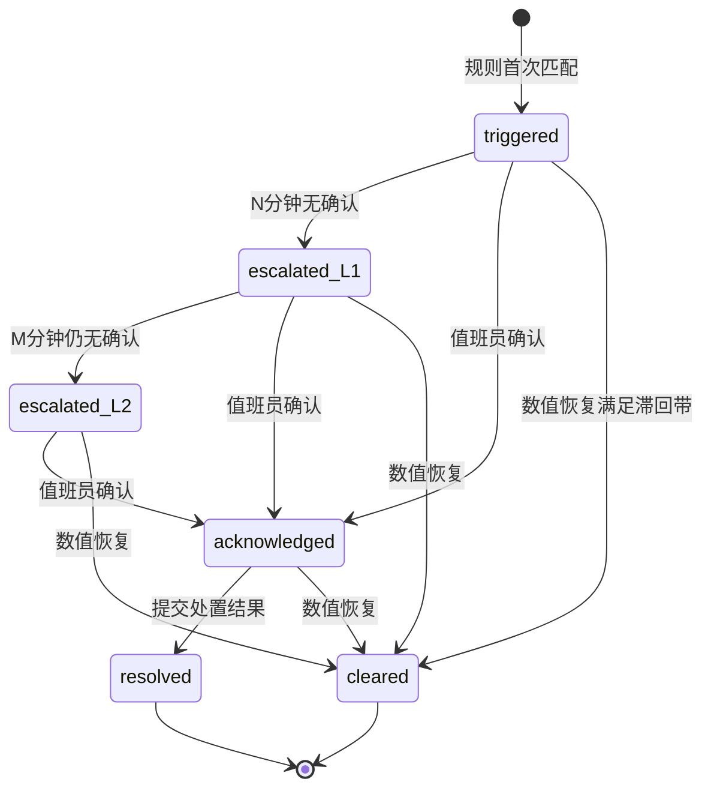

**升级策略（可配）**：

- N、M 时长可按告警等级配置（严重告警 N 更短）
- L1 推送范围：当班值班员
- L2 推送范围：值班长 + 短信 + 电话
- 严重告警可配置"必须人工确认才停止音响"，避免被忽略

**滞回带防边界抖动**：

```
上限触发阈值 = 95，恢复阈值 = 90（滞回带 5）

数值变化序列：
  80  → 96 → 触发，状态 = triggered
  96  → 94 → 不算恢复（>90），状态保持 triggered
  94  → 91 → 不算恢复，状态保持
  91  → 89 → 达到恢复阈值，状态 = cleared
```

滞回带的宽度按测点类型配置（电压类窄、温度类宽）。

**两层去重设计**：

```
一层：一区告警引擎去重（防同一 incident 重复生成）
  靠 (rule_id, point_id) 的 Redis 内存表，同一 key 同时只允许一个 active

二层：四区消息中心去重（防主备切换、网络重试导致的重复推送）
  按 incident_id 建唯一索引，收到相同 incident_id 的事件做 upsert
```

**clear 事件映射回原 incident**：

```
1. 一区告警引擎为每条 active incident 维护 incident_id
2. 数值恢复 → 一区发出 {incident_id, event=clear} 经正向 UDP 上送
3. 四区消息中心按 incident_id 找到对应 active 告警 → 更新为 cleared
4. 若告警已被人工标记 resolved → resolved 优先，不被 cleared 覆盖
5. 若 clear 先到、人工确认后到 → 状态保持 cleared 不变（人工确认对已 clear 的告警仅记录痕迹）
```

**UI 呈现规则**：

| 状态 | 待处理列表 | UI 样式 |
|---|---|---|
| triggered | 显示 | 红色闪烁 |
| escalated_L1 | 显示 | 红色闪烁 + 短信推送标记 |
| escalated_L2 | 显示 | 红色闪烁 + 音响 + 电话推送标记 |
| acknowledged | 显示 | 黄色不闪 |
| cleared | 自动消失 → 进入历史 | 灰色，归档 |
| resolved | 自动消失 → 进入历史 | 绿色，归档 |

---

## 六、主备切换机制

### 6.1 总体策略

| 区 | 角色 | 主备方式 | 仲裁/协调 | 切换时延目标 | 规范依据 |
|---|---|---|---|---|---|
| Ⅰ 区 CS 工作站 | 人机接口 | 4 席独立（非主备），通过 Sentinel 发现后端 | 客户端发现 Redis Master | 单席挂用别的席位，无切换时延 | — |
| Ⅰ 区 Redis Cluster | 当前值仓库 | Master + 2 Replica | Sentinel × 3 自动选主 | 客户端自动重连 ≤5 s | — |
| Ⅰ 区 RocketMQ | 事件流总线 | 3 broker + 副本 | NameServer + Broker 主从选举 | 分区级秒级切换 | — |
| Ⅰ 区 RECV / CMD / 告警 / 转发 | 业务服务 | 主备（VIP+Keepalived 合并实例） | 一套 Keepalived 实例承载所有一区 VIP | ≤5 s | 5.2.1.6 |
| Ⅱ 区归档服务 | 订阅一区 RocketMQ 写入 TDengine | 双节点加入同一消费者组 | RocketMQ 消费者组 rebalance | ≤10 s | — |
| Ⅱ 区 TDengine | 生产控制大区历史库 | 2 节点小集群（主从） | TDengine 内建 Raft | ≤10 s | 5.2.1.5 |
| Ⅱ 区 AGC/AVC 接口 | 下发接口 | 主备（VIP 漂移） | Keepalived VRRP | ≤5 s | — |
| Ⅳ 区 Web | 业务应用 | 多节点集群（Active-Active） | LB+Keepalived | 单节点挂对外无感（<2 s 健康检查） | — |
| Ⅳ 区业务库 | 业务数据 | 主从+VIP 漂移 | Keepalived + MySQL/PG 主从流复制 | ≤10 s | — |
| Ⅳ 区 Redis | 黑名单+缓存 | Sentinel × 3 | 自动选主 | ≤5 s | — |
| Ⅳ 区 TDengine | 管理信息区时序库 | 3 节点集群 | TDengine 内建 Raft | ≤10 s | — |
| Ⅳ 区 RocketMQ | 消息队列 | 集群自带 HA | NameServer + Broker 主从选举 | 分区级秒级切换 | — |

### 6.2 Ⅰ区 主备方案

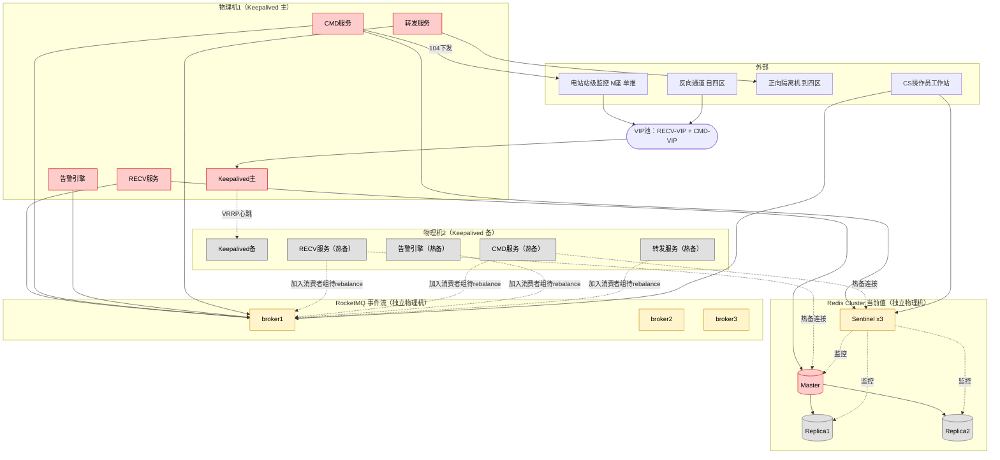

**策略说明**：

- **物理机布置**：
  - 物理机1（主）：跑 Keepalived 主 + RECV + CMD + 告警引擎 + 转发服务，**持有 RECV-VIP 和 CMD-VIP**
  - 物理机2（备）：跑 Keepalived 备 + 同样四个服务的**热备实例**
  - 中间件（Redis Cluster + Sentinel × 3 + RocketMQ × 3）部署在**独立物理机**上，不与一区业务服务混部
- **热备服务的连接**（图中虚线）：
  - 物理机2 上的服务全程运行，与 Redis 和 RocketMQ 保持连接
  - RECV 热备：监听备 IP（不收数据），主挂时 VIP 漂到机2 立即生效
  - CMD/告警/转发热备：维持中间件连接但不处理消息（消费者组里作为备成员）
  - 这样切换时是"立刻接手"而非"启动后接手"，最大化缩短切换时延
- **VIP 合并到一套 Keepalived 实例**：
  - 一套 VRRP 实例同时承载 RECV-VIP 和 CMD-VIP，主挂时两个 VIP 一起漂
  - 节省物理机（2 台 vs 4 台），但需明确"接受同机故障域风险"
- **RECV 主备而非双活**：考虑核电站等只支持单推的电站，电站只对 RECV-VIP 推送，VIP 漂移即切换
- **Redis Cluster + Sentinel × 3**：开源社区版，Sentinel 集群监控主库，自动选主；客户端走 Sentinel 发现
  - Master 故障 → Sentinel 选 Replica1 升主
  - 原 Master 恢复后作为 Replica，Redis 复制机制自动追赶（数据量小，几秒内同步完）
  - 三个 Sentinel 容忍单节点故障，避免脑裂
- **RocketMQ 3 broker**：每个 Topic 多分区多副本，broker 自带选主；分区级秒级切换
- **数据流耦合关系**：
  - RECV 写 Redis（当前值）+ 发 RocketMQ（事件流）
  - 告警引擎、转发服务订阅 RocketMQ
  - CMD 通过 Sentinel 发现 Redis Master，读当前值做闭锁判断
  - CS 工作站通过 Sentinel 读 Redis、订阅 RocketMQ 接收变化推送
- **冷备场景**：指存储/硬件更换导致的人工切换，≤5 min 符合规范

### 6.3 Ⅱ区 TDengine 归档 + AGC/AVC 接口主备

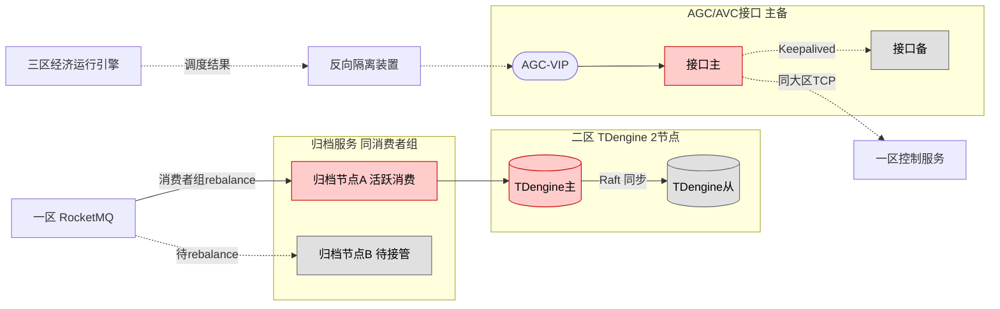

**策略说明**：

- **数据来源**：二区归档服务订阅**一区 RocketMQ**（同大区内 TCP 访问，不经隔离机），"就近归档"不跨大区——这是规范将历史库放在生产控制大区的原意
- **归档服务主备（取消 VIP，使用 RocketMQ 消费者组机制）**：两个归档节点加入**同一个消费者组**，RocketMQ 自动保证同一消息只由一个节点消费；节点故障时 RocketMQ 触发 rebalance，另一个节点自动接管分区；运维监测靠各自健康端口（不需要独立 VIP）
- **TDengine 2 节点小集群**：主从复制，Raft 自动选主；数据量远小于四区，2 节点足够
- **与四区 TDengine 的分工**：
  - 二区 TDengine：**生产控制大区就近历史**，供一区侧事故追忆、AGC/AVC 回溯查询；数据从一区 RocketMQ 直接订阅（同大区内访问）
  - 四区 TDengine：**管理信息区历史**，供 Web 展示、报表、分析；数据经正向隔离机 UDP 上送
  - 两边内容基本一致，但物理隔离、用途不同，不互相依赖（任何一侧挂了另一侧照常工作）
- **AGC/AVC 接口**：
  - **三区经济运行 → 二区 AGC/AVC 接口**：跨大区（Ⅲ→Ⅱ），**经反向隔离装置**
  - **二区 AGC/AVC 接口 → 一区 CMD**：同属生产控制大区，**同大区 TCP 直连**（依靠 ACL 访问控制，不经反向隔离）
  - 接口无状态，VIP+Keepalived 足够；每条指令以"唯一序号 + 下发时间"落**一区 CMD 本地持久化**（非业务库，业务库在四区），切换后可重放避免漏发

#### 二区 TDengine 数据范畴（简版，详细 schema 见 v2 详细设计）

| 类别 | 说明 |
|---|---|
| 测点时序数据 | 模拟量+状态量，所有接入测点的历史值（如"机组 1 A 相电压 220.5kV @2026-05-12 09:00:00"） |
| SOE 事件 | 开关动作、保护动作、状态变化（如"线路跳闸 @14:25:33.456"） |
| 告警事件 | 告警生命周期（triggered→cleared）事件流，关联 `incident_id` |
| 控制指令记录 | AGC/AVC 下发、集控/电站指令、执行结果（任务 ID+操作员+耗时+结果） |

**典型查询场景**：事故追忆（规范 6.1.6）、AGC/AVC 历史回溯、趋势分析、SOE 时序回放。

**不存**：Web 业务数据（→ 四区业务库）、文件（→ 四区 NAS）、视频（→ 萤石云）、配置数据（→ 四区业务库 + 一区 Redis 副本）、当前值（→ 一区 Redis）。

### 6.4 Ⅳ区 Web 与业务库主备

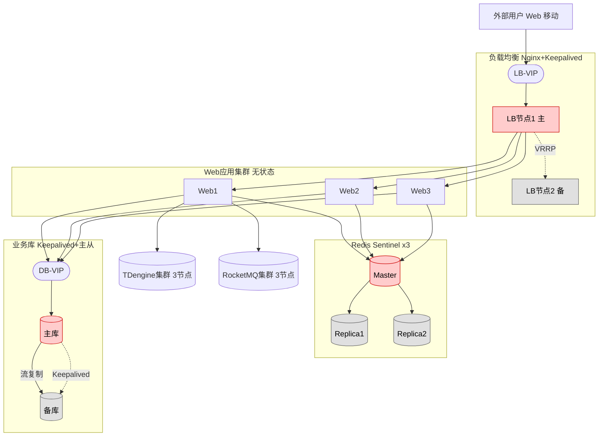

**策略说明**：

- **三层 HA**：
  - LB 层：Keepalived + VRRP（VIP 漂移，≤2 s 切换）
  - Web 层：无状态多副本，节点挂 LB 自动摘除
  - 数据层：业务库 Keepalived + MySQL/PG 主从流复制（和一区风格一致，不引入 Orchestrator/Etcd）
- **JWT + Redis 黑名单 的会话方案**：
  - Web 无状态，不存 session
  - Access Token（JWT，15 分钟有效）+ Refresh Token（JWT，8 小时有效）
  - Redis 仅存"吊销黑名单"：吊销时写入 Token ID，直到自然过期清理；数据量极小（KB 级）
  - 员工离职、权限变更、安全事件触发吊销 → 立即写黑名单生效
- **Redis Sentinel × 3**：黑名单数据+缓存，主从自动切换
- **业务库 Keepalived + 主从**：
  - 主从流复制（半同步模式：关键写同步、非关键异步）
  - Keepalived 监控主库健康，故障时 VIP 漂移到备库
  - 切换期间 Web 写入失败 → 业务层幂等重试（靠任务 ID/操作 ID 去重）
  - 不引入 Orchestrator/Etcd：架构简单、运维风格和一区一致；代价是切换时可能丢失最近几笔异步复制的非关键写
- **TDengine / RocketMQ / Redis 均为集群自带 HA**：分别用 Raft、Broker 主从、Sentinel

### 6.5 主备切换的状态同步策略对比

| 区 | 同步什么 | 同步方式 | 一致性级别 | 失败处理 |
|---|---|---|---|---|
| Ⅰ 区业务服务 | 进行中任务、控制指令上下文 | 任务事件源入业务库（四区） + 一区 Redis 共享 | 强一致 | 主挂即切；任务凭 ID 幂等续接：四区 APP 检测超时未回执的指令 → 经反向隔离重发同 task_id 的指令 → 一区按 task_id 去重，已执行则直接回执，未执行则重新执行 |
| Ⅰ 区 Redis | 测点当前值 | Master → Replica 异步复制 | 最终一致（毫秒级） | Sentinel 自动选主，原主恢复后作 Replica 自动追赶 |
| Ⅰ 区 RocketMQ | 事件流 | Broker 主从复制 | 同步刷盘 + 同步复制可配 | NameServer 协调，分区秒级切换 |
| Ⅰ 区告警引擎 | 告警规则、活跃 incident 表 | 规则库共享 + 活跃 incident 写入一区 Redis | 最终一致（秒级） | 切换后新主从 Redis 加载 incident 表恢复；按 incident_id 去重避免重复推送 |
| Ⅱ 区 TDengine | 历史测点 | 订阅一区 RocketMQ + TDengine Raft 复制 | 最终一致（秒级） | 归档服务主备切换靠 RocketMQ 消费位点延续 |
| Ⅱ 区 AGC/AVC 接口 | 无状态 | 不同步 | — | VIP 漂移即可 |
| Ⅳ 区 Web | 无 session | 无 | — | 完全无状态，JWT 自包含 |
| Ⅳ 区 Redis | Token 黑名单+缓存 | Master → Replica 异步复制 | 最终一致（毫秒级） | Sentinel 自动选主 |
| Ⅳ 区业务库 | 业务数据 | Keepalived + 主从流复制（半同步） | 半同步 | VIP 漂移；切换时异步部分可能丢最近几笔非关键写 |
| TDengine（四区） | 时序数据 | 内建 Raft | 最终一致 | Raft 选主 |
| RocketMQ（四区） | 消息 | Broker 主从 | 同步刷盘可配 | NameServer 协调切换 |

### 6.6 故障演练要求（验收前必做）

参考规范 9.1.1 与 10.0.12：

- **通道切换测试**：人为退出工作通道，备用通道应自动投入，切换中不应死机或中断
- **一区业务服务主备切换**：压测下人为 kill 一区业务机主（RECV/CMD/ALM/FWD），观察 CS 客户端画面、实时数据、进行中控制任务是否受影响
- **业务库主切换**：人为 kill 四区业务库主，验证 Keepalived VIP 漂移 + MySQL/PG 主从切换时延与数据一致性（半同步模式下允许丢失最近几笔异步复制的非关键写，需明确在测试报告中）
- **整区断电恢复**：Ⅳ 区整体断电后重启，验证服务自启动、数据不丢
- **脑裂测试**：人为制造网络分区，验证 Keepalived 的脑裂保护（script_check + 仲裁节点或 VIP 抢占策略），不出现双主
- **Redis 主从切换**：人为 kill Redis Master，验证 Sentinel 自动选主、客户端自动重连
- **RocketMQ broker 切换**：kill 某 broker，验证分区副本切换、消费者重连

---

## 七、部署节点详图

### 7.1 规模基线

- **接入规模**：最大 1.2 万测点
- **并发用户**：500 Web 并发
- **CS 工作站**：4 席
- **数据速率估算**：平均 1.2 万/秒的测点更新 → RocketMQ 吞吐、TDengine 写入、UDP 带宽压力都在小规模范围内

### 7.2 物理部署清单

#### 一区（服务器 5 台 + 工作站 4 席 + 北斗装置 1 台）

| 编号 | 角色 | 数量 | 规格建议 | 部署软件 |
|---|---|---|---|---|
| Z1-01/02 | 业务服务机（Keepalived 合并实例主备） | 2 | 2U / 2×16 核 / 128GB / SSD 960GB×2 RAID1 + HDD 4TB×4 RAID10 / 双电源双万兆网卡 / 麒麟 V10 | RECV、CMD、告警引擎、转发服务、网关管理、Keepalived |
| Z1-03/04/05 | 中间件机 | 3 | 2U / 2×16 核 / 256GB / SSD 1.92TB×4 RAID10 / 双电源双万兆网卡 | 每台部署：Redis 节点（1 Master 或 Replica）+ Sentinel + RocketMQ broker + NameServer |
| Z1-CS-01~04 | CS 操作员工作站 | 4 | 桌面工作站 / 16 核 / 32GB / NVMe 1TB / 独立显卡（多屏输出） / 麒麟桌面版 | CS 客户端（画面渲染+操作）、网关管理前端 |
| Z1-CLK-01 | 北斗时钟同步装置 | 1 | 专用硬件，自带冗余 | — |

#### 二区（4 台）

| 编号 | 角色 | 数量 | 规格建议 | 部署软件 |
|---|---|---|---|---|
| Z2-01/02 | 业务服务机 | 2 | 2U / 2×16 核 / 128GB / SSD 960GB×2 RAID1 / 双电源双万兆网卡 / 麒麟 V10 | 归档服务、AGC/AVC 接口、Keepalived |
| Z2-03/04 | TDengine 节点 | 2 | 2U / 2×16 核 / 128GB / SSD 1.92TB×2 + HDD 8TB×4 RAID10 | TDengine（主从小集群） |

#### 三区（2 台）

| 编号 | 角色 | 数量 | 规格建议 | 部署软件 |
|---|---|---|---|---|
| Z3-01/02 | 应用服务机 | 2 | 2U / 2×16 核 / 128GB / SSD 960GB×2 RAID1 / 麒麟 V10 | 经济运行/梯级调度引擎、智能预警引擎、数据分析服务、Keepalived |

#### 四区（19 台）

| 编号 | 角色 | 数量 | 规格建议 | 部署软件 |
|---|---|---|---|---|
| Z4-LB-01/02 | 负载均衡 | 2 | 1U / 2×8 核 / 64GB / SSD 480GB×2 RAID1 | Nginx、Keepalived |
| Z4-WEB-01~03 | Web 应用服务 | 3 | 2U / 2×16 核 / 128GB / SSD 960GB×2 RAID1 | Web 应用（业务模块、消息中心、视频接入萤石 SDK）、JWT 签发验证 |
| Z4-REDIS-01~03 | Redis 集群 | 3 | 2U / 2×8 核 / 64GB / SSD 960GB×2 RAID1 | Redis（1 Master 或 Replica）+ Sentinel |
| Z4-DB-01/02 | 业务库主备 | 2 | 2U / 2×16 核 / 256GB / SSD 1.92TB×4 RAID10 | MySQL/PostgreSQL（主从半同步）+ Keepalived |
| Z4-TD-01~03 | TDengine 集群 | 3 | 2U / 2×16 核 / 128GB / SSD 1.92TB×2 + HDD 8TB×4 RAID10 | TDengine（3 节点 Raft 集群） |
| Z4-MQ-01~03 | RocketMQ 集群 | 3 | 2U / 2×16 核 / 128GB / SSD 960GB×4 RAID10 | RocketMQ broker + NameServer |
| Z4-GW-01/02 | 数据接收网关 | 2 | 2U / 2×16 核 / 128GB / SSD 960GB×2 RAID1 | UDP 收端 GW、解包/去重/分片到 RocketMQ |
| Z4-NAS-01 | 文件存储 | 1 | 企业级 NAS / 12 盘位 / ≥48TB 可用 | 文件存储（制度/证书/培训档案/视频快照） |

#### 网络与安全设备

| 类型 | 数量 | 规格建议 | 作用 |
|---|---|---|---|
| 一区核心交换机 | 2 | 万兆三层，48×SFP+，双电源 | Ⅰ 区服务器/工作站互联 |
| 二区核心交换机 | 2 | 万兆三层 | Ⅱ 区互联 |
| 三区核心交换机 | 2 | 千兆三层 | Ⅲ 区互联（流量小） |
| 四区核心交换机 | 2 | 万兆三层，48×SFP+，双电源 | Ⅳ 区互联 |
| 接入交换机 | 2 | 千兆 | CS 工作站、桌面终端接入 |
| 防火墙 | 2 | 下一代防火墙，主备 | Ⅳ 区到公网、萤石云、短信、用户访问 |
| 正向隔离机 | 2 | 按电力安防厂商（如南瑞、思源、科东等）采购 | Ⅰ/Ⅱ 区 → Ⅲ/Ⅳ 区，UDP 单向 |
| 反向隔离装置 | 2 | 同上，专用反向型号 | Ⅳ 区 → Ⅰ 区，白名单+签名受限指令 |

#### 其他

- 集控中心大屏显示系统（电视墙 / LED 拼接屏）
- UPS 不间断电源（规范 5.1.6：满负载 2 小时续航）
- 动环监测、门禁、消防设施（规范 4.0.4）

### 7.3 物理部署与网络拓扑图

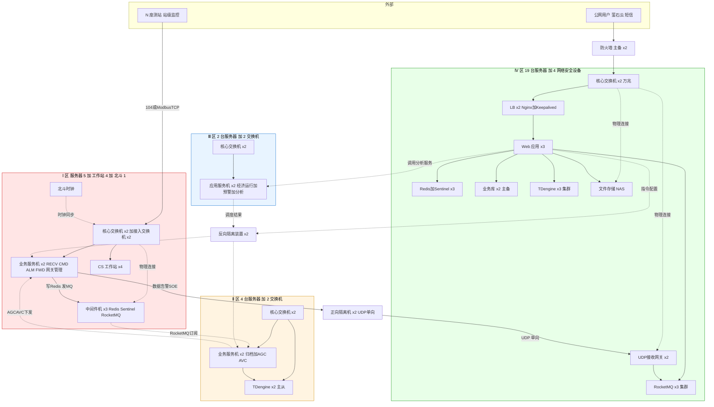

**连线说明（避免混淆）**：

- **104/ModbusTCP 原始报文**只从电站 → 一区交换机 → 一区 RECV **就终止了**，不跨区
- **一区内 104 数据流路径**：Z1_SW → Z1_SVC（RECV 服务）→ Z1_SVC 处理后写 Z1_MID（Redis+RocketMQ）；Z1_SW 到 Z1_MID 是物理布线（交换机要连所有区内节点），但 104 报文不直接投递到中间件，必须经 RECV 处理
- **Ⅰ-Ⅱ 之间**（同属生产控制大区）走服务协议，不走 104：
  - 二区归档服务作为 RocketMQ 客户端订阅一区 RocketMQ
  - 二区 AGC/AVC 接口作为客户端调用一区 CMD 服务
- **Ⅲ-Ⅳ 之间**（同属管理信息大区）走服务协议：四区 Web 调用三区分析服务
- **Ⅰ/Ⅱ ↔ Ⅲ/Ⅳ 跨大区**必经隔离装置：
  - Ⅰ → Ⅳ 走正向隔离机（UDP 单向）
  - Ⅳ → Ⅰ 指令下发、Ⅲ → Ⅱ 调度结果下发，都走反向隔离装置
- 同大区内的两个子区（Ⅰ-Ⅱ、Ⅲ-Ⅳ）按规范可配置防火墙或交换机 ACL 做访问控制；本期硬件清单暂不单独列防火墙，依赖核心交换机的 ACL + 网段规划实现

### 7.4 部署汇总

| 区 | 服务器台数 | 工作站台数 | 网络/安全设备 |
|---|---|---|---|
| Ⅰ 区 | 5（业务机2+中间件3） | 4 | 4 交换机 + 1 北斗时钟 |
| Ⅱ 区 | 4（业务机2+TDengine2） | 0 | 2 交换机 |
| Ⅲ 区 | 2（应用服务机2） | 0 | 2 交换机 |
| Ⅳ 区 | 19（LB2+Web3+Redis3+DB2+TD3+MQ3+GW2+NAS1） | 0 | 2 交换机 + 2 防火墙 |
| 隔离 | — | — | 2 正向 + 2 反向 |
| **合计** | **30** | **4** | **15** |

总约 **49 台设备**（不含 UPS、大屏、动环等配套），属于中小规模集控中心典型规模。

> **备注**：
> - "服务器台数"已包含 LB、业务库、中间件等所有用途的服务器；"网络/安全设备"列仅统计交换机、防火墙、隔离机、时钟这类专用设备，不重复计数
> - 北斗时钟归在"网络/安全设备"列（专用硬件装置，不是通用服务器）

### 7.5 混部与扩展空间

- **紧凑部署（可省 3-4 台）**：如果项目预算紧，Z4 的 GW、Redis、RocketMQ 可以在同物理机上合部；Z2 业务服务机和 TDengine 也可合部到 2 台。紧凑后约 27 台服务器
- **扩展方向**：
  - 测点增至 3 万：Z4 TDengine 扩到 5 节点、RocketMQ 分区加倍、Web 扩到 5 节点
  - 并发增至 1000：Z4 Web 扩到 5-6 节点，LB 保持 2 台足够
  - 接入电站超过 100 座：考虑加集控分中心（规范 3.0.1.2），分层管理
- **灰度升级**：所有主备/集群组件都支持滚动升级，单台升级时其他节点正常服务

### 7.6 存储容量估算

按决策第 24 条 **1.2 万测点**基线，对照规范 5.2.3 历史数据保留要求估算：

**TDengine 时序库**（二区、四区各一套）：

| 精度 | 保留期 | 数据量计算（单条约 40 字节含元数据） | 原始容量 | 压缩后约（TDengine 10:1 压缩） |
|---|---|---|---|---|
| 秒级 | ≥15 天 | 12000 × 86400 × 15 × 40B | ≈ 580 GB | ≈ 58 GB |
| 分钟级（降采样） | ≥15 天 | 12000 × 1440 × 15 × 40B | ≈ 10 GB | ≈ 1 GB |
| 小时级（降采样） | ≥1 年 | 12000 × 24 × 365 × 40B | ≈ 4 GB | ≈ 0.4 GB |
| 事件/SOE | ≥1 年 | 估算 50 万条/天 × 365 × 200B | ≈ 35 GB | ≈ 3.5 GB |
| **小计** | | | **≈ 630 GB** | **≈ 63 GB** |

**四区业务库**（MySQL/PG）：

| 项 | 估算 |
|---|---|
| 告警生命周期事件 | 按 1000 条/天 × 365 × 1 KB ≈ 360 MB |
| 指令记录 + 进度事件 | 按 500 任务/天 × 365 × 5 KB（主表+事件）≈ 900 MB |
| 用户/权限/配置/台账 | ≈ 1 GB |
| 审计日志（>6 个月） | ≈ 2 GB |
| 两票/缺陷/巡检/检修记录 | ≈ 2 GB |
| **小计** | **≈ 6 GB** |

**四区 NAS 文件存储**：

| 项 | 估算 |
|---|---|
| 证件/培训档案/制度文档 | ≈ 10 GB |
| 视频快照（重点告警触发）| 按 500 次/年 × 10 MB ≈ 5 GB |
| 报表导出归档 | ≈ 5 GB |
| **小计** | **≈ 20 GB**（企业级 NAS 48TB 远远足够） |

**硬件规格验证**：
- 二区 TDengine 节点 1.92TB SSD×2 + 8TB HDD×4 RAID10，压缩后 ~63 GB 数据，存储**绰绰有余**
- 四区 TDengine 3 节点同规格，多一份副本不压力
- 四区业务库 1.92TB SSD×4 RAID10，6GB 数据**极大余量**

**结论**：按 1.2 万测点规模，现规格容量**不是瓶颈**；即使扩展到 3 万测点，容量仍有 5-10 倍余量。

### 7.7 网络规划原则

本节定义架构层面的网络规划原则，具体 IP/VLAN 留 v2 详细设计。

**分区与 VLAN 规划**：

| 区 | 用途 | VLAN 规划 | 访问控制 |
|---|---|---|---|
| Ⅰ 区生产控制 | 数据接收、控制、中间件 | 独立 VLAN，禁止与 Ⅲ/Ⅳ 区直通，仅经正向/反向隔离机 | 核心交换机 ACL：白名单源 IP + 端口 |
| Ⅱ 区生产控制辅助 | 归档、AGC/AVC | 独立 VLAN；可与 Ⅰ 区经 ACL 互通 | 同上 |
| Ⅲ 区分析决策 | 经济运行/预警/分析 | 独立 VLAN；可与 Ⅳ 区经 ACL 互通 | 同上 |
| Ⅳ 区管理信息 | Web/数据库/存储 | 独立 VLAN，出公网经防火墙 | 同上 |
| 业务子网 | Web 应用层 | Ⅳ 区内再划子 VLAN（Web/DB/中间件分离） | 同上 |
| 管理子网 | 运维通道（SSH/监控） | 跨区独立 VLAN，强制堡垒机跳转 | 独立 ACL |

**跨区路由规则**：

- **生产控制大区（Ⅰ/Ⅱ）↔ 管理信息大区（Ⅲ/Ⅳ）**：必经正向/反向隔离装置，任何路由或防火墙旁路都不允许
- **Ⅰ ↔ Ⅱ**：同大区，通过核心交换机 ACL + 网段划分控制（参考决策 v1.12）
- **Ⅲ ↔ Ⅳ**：同大区，通过核心交换机 ACL + 网段划分控制
- **Ⅳ → 公网**：经边界防火墙（萤石云/短信/上级监管/用户访问）
- **电站 → 一区**：经专线+纵向加密或公网 VPN，接入一区边界交换机

**IP 网段规划原则**（具体值 v2 详细设计定）：

- 每区独立 /24 或 /23 网段，不重叠
- 服务器固定 IP，工作站可 DHCP
- VIP 预留不少于 5 个/区（当前 RECV-VIP / CMD-VIP 合并 + AGC-VIP + DB-VIP + LB-VIP + 扩展）
- 隔离机两端网口各在对应区 VLAN 内

**带宽规划**：

| 链路 | 估算带宽 | 推荐配置 |
|---|---|---|
| 电站→一区（单座电站） | 约 200 kbps（含视频心跳） | 专线 2 Mbps 起 |
| 正向隔离 Ⅰ→Ⅳ | 约 10 Mbps（1.2 万点 + 冗余 3 倍） | 万兆预留 |
| 反向隔离 Ⅳ→Ⅰ | 约 1 Mbps | 百兆足够 |
| Ⅳ 区内部 Web↔DB | 随并发峰值 | 万兆 |
| Ⅳ 区→公网 | 500 并发 + 视频 | 100 Mbps 起 |

---

## 八、关键非功能性需求落地点

| 需求 | 设计体现 |
|---|---|
| 实时性（规范 5.2.1） | Ⅰ 区内闭环 + 三通路并行；Ⅳ 区接收推送 |
| 可靠性（规范 5.2.2）| Ⅰ/Ⅱ 区主备双机；Ⅳ 区无状态多副本；MTBF≥8000h，年可用率≥99.5% |
| 历史存储（规范 5.2.3）| TDengine 多精度自动降采样：秒级 15 天、分钟级 15 天、小时级 1 年、事件 1 年 |
| 水平扩展 | Ⅳ 区 LB/Web/GW 无状态多副本；TDengine/RocketMQ/Redis 集群自带 HA；按测站 hash 分片；Web 无 session（JWT 自包含）；不可变配置热加载 |
| 时钟同步（规范 5.1.7）| 北斗时钟源，每区独立 NTP 从服务器同步；SOE/UDP/告警时间戳全网一致 |
| 自诊断（规范 6.1.9）| 各服务自身健康监控+异常自动通知运维 |
| 通信强制 HTTPS | 公网侧 + Ⅳ 区内部 Web 全部 HTTPS；证书统一管理 |
| 日志审计 | 关键操作、登录、参数修改、告警确认、用户管理全部记录，保存≥6 个月 |
| 安全等保 | Ⅰ/Ⅱ 区 ≥ 二级（破坏后果严重的 ≥ 三级），Ⅲ/Ⅳ 区 ≥ 一级 |

### 8.1 日志聚合与审计

**选型**：

| 层次 | 技术栈（开源） | 国产化替代 |
|---|---|---|
| 日志采集 | Filebeat / Fluent Bit | 各自国产发行版 |
| 日志传输 | Kafka/RocketMQ 或直接 TCP | 复用四区 RocketMQ |
| 日志存储 | Elasticsearch / Loki | 统信日志 / 东方通 TongLogs / 星环 |
| 日志查询 | Kibana / Grafana Loki | 同上发行版 |

**日志分类与保留**：

| 日志类别 | 内容 | 保留期 | 存储位置 |
|---|---|---|---|
| 运行日志 | 服务启停、性能指标、错误堆栈 | ≥3 个月 | 日志聚合集群 |
| 业务审计日志 | 登录、操作、控制指令、配置变更、告警确认 | **≥6 个月**（规范要求） | 四区业务库 + 日志聚合集群双写 |
| 安全审计日志 | 越权访问、异常登录、token 吊销 | ≥6 个月 | 同上 |
| 告警历史 | incident 全生命周期 | ≥1 年（规范要求） | TDengine + 业务库 |

**跨节点查询**：所有日志带 `trace_id`（请求链路追踪 ID）和 `service_name`，可跨节点关联。

**跨区日志汇聚**：一区日志先在一区聚合，经正向隔离 UDP 按需上送关键审计日志到四区（不是全量上送，避免占用带宽）；一区本地日志保留供现场排查。

### 8.2 系统自身监控

**选型**：Prometheus + Grafana（监控可视化）+ Alertmanager（监控告警）

**监控对象与阈值**（典型值，具体按项目调）：

| 维度 | 指标 | 阈值 | 触发动作 |
|---|---|---|---|
| 服务器 | CPU 使用率 | >80% 持续 5 min | 运维告警 |
| 服务器 | 内存使用率 | >85% 持续 5 min | 运维告警 |
| 服务器 | 磁盘使用率 | >80% | 运维告警 |
| 服务器 | 磁盘使用率 | >90% | 严重告警+自动清理过期日志 |
| 网络 | 接口丢包率 | >0.1% | 运维告警 |
| 数据库 | 连接数 | >90% 上限 | 运维告警 |
| RocketMQ | 消费者 lag | >10000 | 运维告警（对应 8.3 背压策略） |
| Redis | Master 不可达 | Sentinel 选主 | 自动切换 + 事件上报 |
| 隔离机 | 帧率异常 | <1/s（正常应 1000+/s） | 严重告警 |
| 通信通道 | 心跳中断 | >30 秒 | UDP 对账第二层触发 + 告警 |

**告警分级**：
- L1 运维：运维值班（短信/企微机器人）
- L2 严重：值班长 + 电话
- L3 紧急：影响生产控制的故障（触发应急预案）

**自监控与业务告警分开**：Prometheus 监控的是"平台自身健康"，和电站告警是两个独立体系，分别归消息中心的不同 type。

### 8.3 第三方依赖降级策略

| 第三方 | 故障影响 | 检测方式 | 降级策略 |
|---|---|---|---|
| **萤石云**（视频） | 视频不可用 | API 健康检查 + WebSocket 心跳 | 视频页面显示"不可用" + 告警照常推送；恢复后自动重连 |
| **短信网关** | 短信推送失败 | 推送 API 返回码 | 重试 3 次 → 失败落"待重试"队列，10 分钟后重试 → 持续失败改走 APP 推送 + Web 弹窗 |
| **上级监管平台** | 数据同步失败 | 接口响应 | 缓存本地待上送队列，恢复后自动补推 |
| **北斗时钟装置** | 时钟不同步 | NTP 偏差监测 | 各区本地 NTP 从服务器缓存 + 自由运行 30 分钟 → 超过告警 |
| **专线/VPN（到电站）** | 数据中断 | 一区 RECV 心跳 | 自动切备用通道（若配置双通道）+ 电站站级本地自治继续运行（规范 8.2.1.1） |
| **反向隔离装置** | 控制/配置下不去 | 反向通道心跳 | Web 显示"反向通道故障" + 集控操作受限告警（只能 Ⅳ 区查看，不能控制）+ 告警阈值维持上次同步配置 |
| **正向隔离装置** | 数据上送中断 | 四区 GW 无收到 | UDP 对账三层兜底（冗余+反向对账+人工）+ 二区 TDengine 通过同区 MQ 订阅保证一区本地完整归档 |

**核心原则**：任何第三方故障**不得影响一区实时控制**；四区业务可降级展示，但一区操作员必须能继续控制电站。

### 8.4 端到端时延分解

按规范 5.2.1 各项指标，逐段累计估算：

**上行：现场设备 → 用户 Web 看到**

| 段 | 估算时延 | 规范限值 |
|---|---|---|
| 现场设备 → 站级监控（Modbus/OPC） | 100-500 ms | 站级内部，规范不约束 |
| 站级监控 → 一区 RECV（104/ModbusTCP） | 100-300 ms | — |
| 一区 RECV → Redis/MQ（写入） | 5-20 ms | — |
| 一区 MQ → FWD → 正向隔离 | 20-50 ms | — |
| 正向隔离 UDP → 四区 GW | 5-10 ms | — |
| 四区 GW → MQ → TDengine/业务库 | 10-30 ms | — |
| 四区 Web → 用户浏览器（WebSocket） | 50-200 ms | — |
| **合计** | **300-1100 ms** | 模拟量 ≤3 s ✓、状态量 ≤2 s ✓ |

**下行：用户 Web 发起 → 设备执行**

| 段 | 估算时延 | 规范限值 |
|---|---|---|
| Web 提交指令 → 四区 APP 校验落库 | 100-300 ms | — |
| 四区 APP → 反向隔离 → 一区 CMD | 50-200 ms | — |
| 一区 CMD 二次校验 + 104 下发到站级 | 100-300 ms | — |
| 站级 → 设备执行 | 200-1000 ms | 站级内部 |
| **合计** | **450-1800 ms** | 遥控/遥调 ≤2 s ✓ |

**关键瓶颈**：站级和现场设备的执行时延占总时延的较大比例，集控侧时延控制在 500ms 以内。

---

## 九、需求溯源与功能对齐

本章把 Excel 需求文档中的功能点映射到本概要设计的架构归属，便于验证覆盖度和详细设计阶段的分工。

### 9.1 智能监控域（一区采集+控制，四区展示）

| Excel 需求 | 架构归属 | 相关章节 |
|---|---|---|
| 水电站自动化（主页/主接线/开停机/运行监视） | 四区 Web 应用 + 一区 CS 工作站；数据来自一区 Redis（当前值）和四区 TDengine（历史） | 二、三、四 |
| 智能发电/梯级调度（水文分析/预演/发电优化） | 三区经济运行引擎 | 二、六、七 |
| 视频监视（运维中心/测站/公司视频） | 四区视频接入（萤石云）| 二、决策 10 |
| 消息（全部消息/告警设置/故障告警展示/告警推送/告警处理） | 五、告警处理流程 + 四区消息中心 | 五 |
| 智能预警（开机/泄洪/超温/消防预警） | 三区智能预警引擎 | 二 |
| 闸门/清污机/生态下泄流量（同自动化模式） | 四区 Web 复用自动化框架；点模型归在 v2 详细设计 | 十一 |
| 数据分析（区域选择/指标/时间段） | 四区 Web + 三区数据分析服务 + TDengine | 二 |
| 测点巡检（视频+实时数据多测点滚动轮播） | 四区 Web 模块，轮询一区 Redis + 萤石云视频 | 二 |

### 9.2 运维管理域（四区业务）

| Excel 需求 | 架构归属 | 相关章节 |
|---|---|---|
| 运维首页（dashboard） | 四区 Web 入口 | 二 |
| 安全管理（防汛/消防/制度/隐患/持证/组织/培训/目标）| 四区 Web + 四区业务库 + NAS（文件） | 二 |
| 用户管理（用户/公司/测站/运维中心/视频/权限） | 四区 Web + 业务库 | 二 |
| 设备管理（台账/参数/模型/备品备件/类型/评级/检修履历） | 四区 Web + 业务库 + 一区点表同步（决策 27） | 二、4.2 |
| 运行管理（定期工作/两票/值班/巡检/缺陷/检修/消息）| 四区 Web + 业务库 + 审批流 | 二 |
| 生产报表（运行日志/运行报表/结算/生产计划） | 四区 Web + 业务库 + TDengine | 二 |
| 网关管理 | **一区 CS 工作站子模块**（决策 23，非四区 Web） | 决策 23 |
| 考察验收 | 四区 Web 业务模块 | 二 |

### 9.3 基础设施监控（跨区运维）

| Excel 需求 | 架构归属 | 相关章节 |
|---|---|---|
| 服务器状态监控（每台服务器网络/磁盘/主备/CPU/内存） | 四区 Web + Prometheus（决策见 8.2） | 8.2、十 |
| 网络拓扑图（实时状态） | 四区 Web 新增页面 | 十 |

### 9.4 手机端

| Excel 需求 | 架构归属 | 相关章节 |
|---|---|---|
| 手机浏览器访问（响应式） | 四区 Web 响应式布局（决策 12） | 决策 12 |

### 9.5 未在本文档展开但已标注

- **自动化/下泄/清污机点模型和消息模板**：v2 详细设计（已在第十一章清单）
- **两票/缺陷/巡检/检修审批流** 具体流程节点：v2 详细设计
- **主页 dashboard 具体布局**：v2 详细设计/UI 设计阶段

---

## 十、菜单补充：网络拓扑图

### 10.1 菜单位置

建议位置：**一级目录"服务器状态监控"** 升级为 **一级目录"基础设施监控"**，下含：

```
基础设施监控（一级）
  ├─ 网络拓扑图（二级，新增）
  └─ 服务器状态监控（二级，原一级降级）
```

或最小改动方案：保留"服务器状态监控"为一级目录，新增"网络拓扑图"为同级一级目录，视用户导航偏好决定。**本文档按"基础设施监控"一级 + 两个二级的结构推进**。

### 10.2 页面功能

**核心诉求**：显示集控系统全链路设备的实时状态。

| 类别 | 监控对象 | 状态维度 |
|---|---|---|
| 集控中心服务器 | Ⅰ/Ⅱ/Ⅳ 区各类服务器 | 在线、主备、CPU、内存、磁盘 |
| 网络设备 | 核心交换机、路由器、LB | 在线、端口流量、故障 |
| 安全设备 | 正向隔离机、反向隔离装置 | 在线、帧率、丢包率 |
| 通信通道 | 专线+纵向加密、公网 VPN | 连通性、时延、抖动 |
| 测站侧 | 站级监控系统（每座测站一个节点，含水电站/光伏/储能/大坝等） | 在线、最近上送时间 |
| 外围 | 萤石云、短信网关 | API 可用性 |
| 时钟源 | 北斗时钟同步装置 | 锁星状态、偏差 |

### 10.3 前端呈现

- **拓扑视图**：按安全分区自上而下分组（Ⅰ/Ⅱ/Ⅲ/Ⅳ + 测站侧 + 外围），设备以图标节点显示，连线代表实际网络链路
- **状态色**：绿（正常）、黄（告警/性能劣化）、红（故障/离线）、灰（未纳管）
- **实时刷新**：WebSocket 订阅，状态变化即时变色 + 闪烁
- **节点点击**：弹出侧边栏，展示该设备的明细指标、近期状态变化、关联告警
- **拓扑自定义**：管理员可手工调整节点位置、增加备注，保存布局
- **告警联动**：设备故障时节点红色闪烁，点击直接跳转故障告警详情

### 10.4 数据来源

| 对象 | 采集方式 |
|---|---|
| 服务器指标 | Node Exporter / SNMP / 国产 OS 原生监控 Agent |
| 网络设备 | SNMP Trap + 轮询 |
| 隔离设备 | 厂商 API 或专用接口（部分设备支持 Syslog） |
| 通信通道 | 应用层心跳（一区 RECV 统计每个数据源最近上送时间） |
| 站级监控 | 一区 RECV 服务心跳（每个源独立） |
| 外围服务 | 应用层健康检查接口 |

### 10.5 拓扑数据模型（简述）

```
Node（节点）:
  id, name, type, zone, ip, parent_id, x, y, icon
  
Link（连线）:
  id, source_id, target_id, protocol, bandwidth
  
Status（状态，实时）:
  node_id, state(online/offline/warning/error), metrics(cpu/mem/disk), last_update
```

**注**：该页面定位为运维辅助工具，与第 6 章"主备切换机制"配合使用——拓扑图显示当前谁是 Active、切换发生时节点状态实时变化。

---

## 十一、本期不展开但需后续设计

| 项目 | 后续设计版本 |
|---|---|
| 数据库 ER 模型（业务库、时序库 schema） | v2 详细设计 |
| 接口协议（隔离机数据帧格式、反向指令签名） | v2 详细设计 |
| **反向隔离装置指令格式**（决策第 4 条落地） | v2 详细设计专题，含：①白名单（源IP+源服务+目标服务+指令类型）②签名算法（HMAC-SHA256 或国密 SM3-HMAC）③防重放（nonce + 时间戳±30s 窗口）④密钥管理与轮换 ⑤异常处理（验签失败/过期/重放的落库告警） |
| 自动化/下泄/清污机的点表模板 | v2 详细设计 |
| 消息模式清单（三类业务全部消息模板）+ 告警规则语法 | v2 详细设计（消息设计专题） |
| 消息类型枚举与分级（规范 6.1.5） | v2 详细设计 |
| **配置数据反向同步机制**（对应决策第 27 条） | v2 详细设计专题，含：①同步报文格式 ②版本号与增量机制 ③一区配置存储（Redis + 文件副本）④热加载与生效通知 ⑤回执经正向通道回传 ⑥首次部署全量灌入 ⑦灾备恢复流程 ⑧各配置类的同步频率/优先级 |
| 等保合规对照表 | v2 详细设计 |
| **配置同步回执完整机制** | v2 展开：①哪个服务生成回执（按配置类别分）②回执报文格式（版本号+加载成功/失败+错误原因）③同一版本多服务回执汇总策略 ④回执丢失/超时的四区再下发机制 |
| **控制指令幂等续接详细机制** | v2 展开：①task_id 生成规则（UUID + 四区生成）②去重状态存储位置（一区 Redis 的 task_ids 键，TTL=24h）③重发指令的识别流程（CMD 收到后先查 task_id）④Redis 主备切换时 task_id 记录丢失的兜底（幂等窗口 + 业务库事件源作为权威） |
| **告警 incident_id 生成与持久化边界** | v2 展开：①incident_id 生成（一区 ALM 发生即刻 UUID v4）②同步顺序（先写一区 Redis→发 MQ→FWD→UDP→四区，主备切换从 Redis 恢复）③四区消息中心对同 incident_id 多事件的时间戳排序 upsert ④Redis 故障期告警通过 MQ 持久化兜底 |
| **控制状态字同步延迟 SLA** | v2 定义：control_mode 从现场拨开关到四区业务库更新 ≤5s；control_enabled 四区挂牌到一区生效 ≤3s；health 状态变化 ≤2s |
| **二区 AGC/AVC → 一区 CMD 通信协议** | v2 展开：①协议格式（HTTP/gRPC 二选一）②CMD 侧是否对 AGC/AVC 指令做"二次校验"③心跳保活 ④断连重试 ⑤流控 |
| **首次部署全量配置灌入流程** | v2 展开：①一区服务启动的拉取请求格式 ②超时与重试 ③拉取失败时启动策略 ④版本号校验 |
| **规范 9.1.6 第三方评测** | 签约后进入第三方评测流程（功能性/易用性/维护性/可靠性/安全性），通过 GB/T 25000.10 |
| **规范 9.1.7 等保测评** | 签约后进入等保测评（Ⅰ/Ⅱ 区二级或三级；Ⅲ/Ⅳ 区一级），按 GB/T 22239 |
| **服务启动依赖顺序 SOP** | v2：定义中间件→业务服务→应用层启动顺序，各服务健康检查端口与超时 |
| **集成测试矩阵** | v2：覆盖数据流完整性、控制流权限、主备切换、配置同步失败恢复、隔离机故障兜底 |
| **备份恢复策略**（RTO/RPO + 灾备演练） | v2：业务库每日全量+增量、TDengine 副本快照、配置导出归档；RPO ≤1 小时、RTO ≤30 分钟 |
| **数据迁移方案** | v2：从既有系统接入本平台时，点表/历史数据/告警规则的导入工具及验证机制 |
| **软件升级策略**（灰度/回滚/兼容性） | v2：版本兼容矩阵、灰度发布步骤、数据库迁移脚本、回滚 SOP |
| **用户权限初始化** | v2：超级管理员创建流程、首次登录强制改密、密码强度策略、可选 MFA、堡垒机 |
| **越权访问检测与安全告警** | v2：异常登录（异地/非工作时间）、权限提升、批量操作的检测规则与告警 |
| **配置变更审计链路** | v2：决策 27 同步配置时谁改了什么的端到端审计记录、版本号关联、追溯查询 |
| **数据脱敏规则** | v2：日志/导出/调试中对电站名/测点名/操作员等敏感信息的脱敏策略 |
| 数字孪生预留接口规格 | v3 后续 |

### 11.1 运维手册（独立交付，不在本概要设计内）

以下属于**运维手册**范畴，不在概要设计文档内展开，签约后单独交付：

| 项 | 内容 |
|---|---|
| **机房断电恢复 SOP** | 整个 Ⅳ 区或多区断电后的服务启动顺序、数据一致性检查、对账步骤 |
| **网络中断 SLA 与断点续传** | 与电站网络中断的最大容忍时间（建议 ≤2 小时为对账自动触发，>2 小时人工介入）、UDP 对账三层机制的实际执行手册 |
| **站级监控故障恢复后数据补齐** | 站级故障恢复时如何识别缺失数据时段、触发数据补齐、验证完整性的具体步骤 |
| **故障演练 SOP** | 6.6 节列出的所有故障演练项的执行手册 |
| **日志/告警查询手册** | 各类问题排查路径、日志关键字、Grafana 仪表盘 URL、常见问题处置 |

---

## 术语表

| 术语 | 全称/含义 | 出现章节 |
|---|---|---|
| 一区/二区/三区/四区 | 规范 3.0.2 定义的安全分区：Ⅰ/Ⅱ 生产控制大区，Ⅲ/Ⅳ 管理信息大区 | 全文 |
| CS | Client/Server 架构，一区操作员工作站采用 | 决策 2 |
| BS | Browser/Server 架构，Ⅲ/Ⅳ 区 Web 应用采用 | 决策 2 |
| RECV | 一区数据接收服务（Receiver） | 二、三、六 |
| CMD | 一区控制服务（Command Service），接收 Ⅳ 区指令并下发到站级 | 二、四、六 |
| ALM | 一区告警引擎（Alarm Engine） | 二、五 |
| FWD | 一区转发服务（Forwarder），将事件打包经正向隔离机送四区 | 二、三、六 |
| GW | 四区 UDP 接收网关（Gateway） | 二、三、七 |
| VIP | Virtual IP，虚拟 IP 地址，主备切换时漂移 | 六 |
| VRRP | Virtual Router Redundancy Protocol，Keepalived 使用的主备协议 | 六 |
| Keepalived | 开源主备高可用软件，靠 VRRP 实现 VIP 漂移 | 六 |
| Sentinel | Redis 集群的选主/故障检测组件 | 决策 20、六 |
| Raft | 分布式共识算法，TDengine 集群使用 | 六 |
| RocketMQ | 开源分布式消息队列 | 决策 17、二、三 |
| TDengine | 国产开源时序数据库（本项目用于二区和四区历史存储） | 决策 5、六 |
| JWT | JSON Web Token，无状态会话凭证（决策 22） | 决策 22 |
| SOE | Sequence of Events，事件顺序记录（毫秒级时标） | 三、五 |
| incident_id | 告警生命周期唯一 ID（UUID v4），参考 ISA-18.2/PagerDuty 行业术语，与 Web 用户会话无关 | 五 |
| task_id | 控制指令唯一 ID，用于幂等续接 | 四、6.5 |
| control_mode | 三方式控制权限字段：local/station/central | 4.1 |
| control_enabled | 是否允许遥控的使能字段（人工挂牌综合） | 4.1.2 |
| health | 设备健康度综合（通信+质量+自诊断）：good/degraded/bad | 4.1.2 |
| controllable | 控制放行计算字段（mode+enabled+health 综合） | 4.1.2 |
| AGC/AVC | Automatic Generation Control / Automatic Voltage Control，自动发电/电压控制 | 决策 16 |
| SCADA | Supervisory Control and Data Acquisition，数据监控与采集系统（本项目已拆为 RECV/CMD/ALM/FWD 四个独立服务） | 决策 2 |
| 正向隔离机 | Ⅰ/Ⅱ 区 → Ⅲ/Ⅳ 区的单向 UDP 数据上送装置 | 决策 3 |
| 反向隔离装置 | Ⅳ/Ⅲ 区 → Ⅱ/Ⅰ 区的受限指令下发装置（白名单+签名） | 决策 4 |
| 萤石云 | 海康威视旗下公有云视频平台（本项目视频接入方案，决策 10） | 决策 10 |
| 规范 | 指 SL/T 870—2026《小水电集控中心技术规范》 | 全文 |

---

## 十二、变更记录

| 版本 | 日期 | 说明 |
|---|---|---|
| v1 | 2026-05-11 | 头脑风暴定型，输出 4 张架构图 + 决策摘要 |
| v1.1 | 2026-05-11 | 删除北斗短报文；明确一区SCADA后端服务与CS工作站分层；补充UDP三层对账机制；补充告警状态机/滞回带/会话ID映射；补充Topic分区说明 |
| v1.2 | 2026-05-12 | 新增第六章"主备切换机制"（Ⅰ/Ⅱ/Ⅳ区主备方案+切换时延+状态同步+故障演练）；新增第八章"菜单补充：网络拓扑图"（基础设施监控一级目录下）；章节顺序重排 |
| v1.3 | 2026-05-12 | 取消独立"实时库"组件，改为 Redis Cluster（当前值，开源社区版）+ RocketMQ（事件流，替代 Kafka）组合；RECV 改为 VIP+主备（考虑核电站等只支持单推）；RECV-VIP 与 CMD-VIP 合并到同一套 Keepalived 实例（2 台物理机混部）；Sentinel 3 节点；重写第六章 6.1/6.2/6.5 + 更新第二章拓扑图 Z1 + 第三章采集流程图 + 第四章 CMD 访问方式 |
| v1.4 | 2026-05-12 | 6.2 Ⅰ区主备图补齐备机到 Redis/RocketMQ 的热备连线并明确服务与物理机归属；6.3 二区历史库改为 TDengine 2节点小集群（订阅一区 RocketMQ，不再跨隔离机拉数据），取消 PG/MySQL 双活消费方案；6.4 四区业务库去掉 Orchestrator+Etcd，改为 Keepalived+主从流复制；会话改为 JWT（Access 15min+Refresh 8h）+ 四区 Redis 黑名单方案（取消外置 session）；8.2 网络拓扑图中"电站侧"→"测站侧"；同步更新状态同步策略表 |
| v1.5 | 2026-05-12 | 告警去重术语统一：`alarm_session_id` / 触发会话ID 全部更名为 `incident_id`（参考 ISA-18.2/PagerDuty 行业通用术语），避免与 Web 用户会话概念混淆；明确告警引擎内部状态表持久化到一区 Redis（主备切换可恢复）；明确"两层去重"设计（一区按 rule_id+point_id 防重复生成、四区按 incident_id 防重复推送） |
| v1.6 | 2026-05-12 | 决策摘要新增 23-26（网关管理位置/接入规模/席位数/国产化策略）；新增第七章"部署节点详图"（接入 1.2 万测点+500 并发规模基线、每区物理机清单+规格+部署软件、物理部署网络拓扑图、部署汇总、混部与扩展空间）；章节编号重排；"本期不展开"更新消息模式清单延后至消息设计专题 |
| v1.7 | 2026-05-12 | 修正 7.3 物理部署拓扑图：①修 Mermaid 语法问题（双向带标签拆单向、边标签含减号+引号包裹、罗马数字+减号改"至"）；②逻辑修正——104 原始报文只到一区 RECV 终止，不跨区；跨区交互改画服务间虚线（Ⅰ-Ⅱ 走 RocketMQ 订阅+AGC/AVC 下发、Ⅲ-Ⅳ 走 Web 调用分析服务、Ⅲ→Ⅱ 走反向隔离下发调度结果）；③不引入独立防火墙节点，Ⅰ-Ⅱ 和 Ⅲ-Ⅳ 同大区子区访问控制由核心交换机 ACL+网段规划实现 |
| v1.8 | 2026-05-12 | 识别并补登"配置数据反向同步"主题（原文漏项）：决策摘要新增第 27 条（权威源全部在四区、反向隔离 push+一区热加载、配置清单 7 类：点表/设备模型/告警规则/电站接入/闭锁/控制权限/AGC-AVC 参数）；第四章控制流程说明补充反向通道用途（控制指令+配置同步）；第十章"本期不展开"新增"配置同步机制"专题项供 v2 详细展开 |
| v1.9 | 2026-05-12 | 第四章新增 4.1 "三方式控制权限状态机"小节（规范 6.1.3 落地）：定义三种方式+优先级（local>station>central）；状态机图展示合法转换；全链路校验机制（现场屏柜为权威源+站级/一区Redis/四区业务库副本+指令链路三次校验）；集控发起切换的序列图；无扰动切换五步保证；控制方式不影响数据上送；切换审计留痕 |
| v1.10 | 2026-05-12 | 4.1 补充"可控性"维度（方案C）：新增 4.1.2 "完整控制状态字"小节，采用 3 字段+1 计算字段设计（control_mode/control_enabled/health/controllable）；4.1.4 全链路校验升级为校验完整 controllable 计算结果（不只 mode），任一字段不满足都拒指令并附具体原因；4.1.5 序列图校验逻辑同步更新；小节编号顺移 |
| v1.11 | 2026-05-12 | 7.3 图逻辑修正：一区 104 数据流路径明确化——Z1_SW 到 Z1_MID 降级为虚线（仅物理布线），新增实线 Z1_SVC 到 Z1_MID 标注"写Redis 发MQ"，体现"104 只到 RECV 终止、RECV 处理后才写中间件"的正确顺序；连线说明同步补充 |
| v1.12 | 2026-05-12 | 整体自检修正：①第二章拓扑 Z1_REDIS→Z2_HIS 改为 Z1_MQ→Z2_HIS（二区归档订阅的是 MQ 不是 Redis），Z3→Z2_AGC 加反向隔离中转；②6.1 表删除过时的"Ⅰ 区 SCADA"行，改列 CS 工作站；③6.2 拍平嵌套 subgraph（Redis/RocketMQ 升为同级）；④6.3 AGC/AVC 接口→CMD 由"经反向通道"改为"同大区 TCP"（同大区内不经反向隔离），新增"二区 TDengine 数据范畴"小节（4 类：测点时序/SOE/告警/控制记录）；⑤6.6 故障演练去掉 Orchestrator 和 Etcd，改 Keepalived+脑裂保护；⑥7.2/7.3/7.4 部署数字全部对齐（Ⅰ区服务器5+工作站4+北斗1、Ⅳ区19、合计30，总设备49）；⑦7.3 图 Z4_GW/Z4_NAS 补挂 Z4_SW 物理连接；⑧4.1.2 health 三态语义加说明（good/degraded/bad，本期 degraded 保守视为不可控）；⑨第八章水平扩展措辞更新为 JWT 无 session + 不可变配置热加载 |
| v1.13 | 2026-05-12 | 第二次整体自检：①**第二章拓扑图整体重画**——补全 Ⅳ 区缺失组件（LB/Redis/RocketMQ）、Ⅱ 区补 TDengine 节点、删除孤立的 Z1_SCADA、补控制下行链路 Z1_CMD→站级、修四区 Z4_GW→Z4_MQ→多消费者 fanout 路径、删除 v1.12 误引入的 Z1_REDIS→Z1_MQ 错连、Z4_FILE 统一为 Z4_NAS；②第三章 sequence 加"四区RocketMQ"participant，GW→MQ4→TDB/BIZ/WebSocket 分发；③4.1.5 sequence FWF→APP 加 GW 和 MQ4 中转；④6.5 状态同步表首行"Ⅰ 区 SCADA"过时行改为"Ⅰ 区业务服务" |
| v1.14 | 2026-05-12 | **取消临时直连通道**，Ⅳ→Ⅰ 反向路径统一走反向隔离装置：决策摘要第 4 条简化；第二章拓扑删 FW_T 节点和连线；第四章 sequence 删 `alt 临时通道` 分支改为单一反向隔离路径；第四章说明"两个反向路径"改为"统一走反向隔离装置"；9.2 监控对象表删"临时通道" |
| v1.15 | 2026-05-12 | 第三次整体自检，修 11 处：①第四章 sequence 彻底删 SCADA participant，CMD 直接对 STA 发 104；4.1.5、4.1.4、6.6、7.2 同步清理 SCADA 残留 ②新增 4.2"配置数据反向同步路径"小节，列 7 类配置的更新-下发-接收-热加载-回执路径 ③第二章说明补告警链路 ④北斗时钟说明改为通过核心交换机 PTP/NTP 全网下发 ⑤四区 RocketMQ 用途集中说明（fanout/告警分发/配置同步事件总线/Web异步任务）⑥第十章新增反向隔离指令格式 v2 详细设计项（白名单+签名+防重放+密钥管理）⑦6.5 表"任务凭ID续接"展开为完整幂等续接说明 ⑧6.3 二区归档去 VIP，改用 RocketMQ 消费者组 rebalance 机制；6.1 表同步 ⑨第三章 sequence 拆 BIZ 与 MSG 为独立 participant ⑩6.2 图"订阅备成员"改为"加入消费者组待rebalance" ⑪7.4 表加脚注说明服务器台数和网络/安全设备的口径 |
| v1.16 | 2026-05-12 | 第四次深度自检，精修 5 处+v2 清单新增 7 项：①第二章四区 RocketMQ 场景表分"主 fanout 消费者"（图中可见 3 条）和"派生订阅者"（图中未画）②第二章北斗时钟改为"每区独立 NTP 从服务器"（跨大区不直接走 PTP）③第二章新增"四区 RocketMQ 消息堆积与背压策略"（监控/TTL/不回压一区/降级/扩容）④新增 7.6"存储容量估算"（TDengine/业务库/NAS 分项计算，验证硬件规格绰绰有余）⑤新增第八章"端到端时延分解"（上行/下行逐段累计验证规范 5.2.1）⑥第十章新增 7 项 v2 详细设计专题：配置同步回执机制、控制指令幂等续接、incident_id 生成边界、控制状态字同步 SLA、二区 AGC/AVC 通信协议、首次部署全量灌入、规范 9.1.6/9.1.7 评测流程 |
| v1.17 | 2026-05-12 | 第五次深度自检（实施+运维视角），新增 7 处架构层内容+新增章节+清单拓展：①文档开头加**目录**索引 ②新增 **7.7 网络规划原则**（VLAN 划分、跨区路由规则、IP 网段规划原则、带宽规划）③新增 **8.1 日志聚合与审计**（选型+分类+保留+跨区汇聚）④新增 **8.2 系统自身监控**（Prometheus+Grafana+Alertmanager 选型、监控对象与阈值表、告警分级）⑤新增 **8.3 第三方依赖降级策略**（萤石云/短信/监管/北斗/VPN/隔离装置 7 种依赖的降级方案）⑥原 8 章的"端到端时延分解"改为 **8.4** ⑦新增**第九章 需求溯源与功能对齐**（把 Excel 的 4 大功能域映射到架构归属）⑧原第九章/十/十一顺移为第十/十一/十二 ⑨变更记录前新增**术语表**（30+ 术语集中定义）⑩第十一章 v2 清单新增 9 项（启动顺序/集成测试/备份恢复/数据迁移/升级/用户初始化/越权检测/配置审计/数据脱敏）⑪新增 **11.1 运维手册**专项段落（断电恢复/网络中断 SLA/数据补齐/演练 SOP/日志查询手册 5 项，标注独立交付） |
